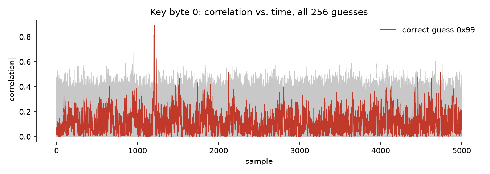
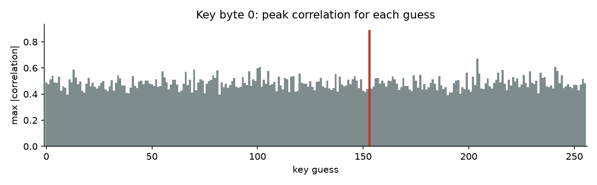
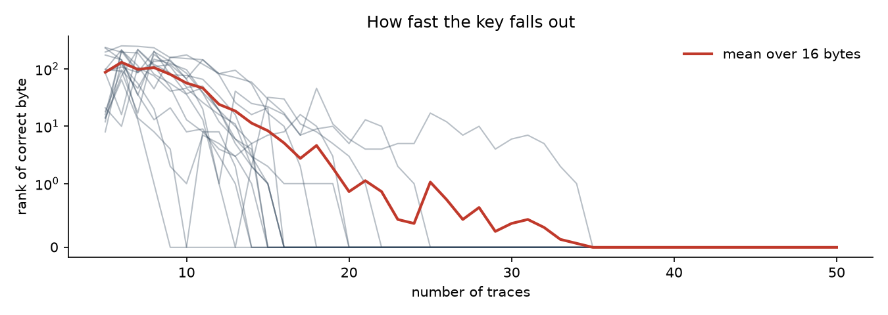

# Correlation power analysis

50 real power traces of an AES-128 encryption (5000 samples each), with the plaintexts and ciphertexts (`real-traces.pkl`).

**Model.** When the device writes `Sbox(pt[i] ⊕ k[i])` in round 1, its power draw varies with the Hamming weight of that byte. For each of the 256 guesses of `k[i]`, predict that Hamming weight for every trace, then take the Pearson correlation against every sample. The right guess lines up with the real leakage and gives a spike. The wrong ones stay in the noise.

- `cpa.ipynb` is the lab notebook, filled in and run.
- `cpa.py` does the same thing vectorized (all 256 guesses × 5000 samples in one matrix multiply), checks the key by re-encrypting, and draws the plots.

```
$ python cpa.py
key: 99b74f8d739335400709a6711e6e1f87
AES(pt[0], key) == ct[0]: True
traces needed for every byte to stay at rank 0: 35
```

The right guess peaks at |r| between 0.84 and 0.92 depending on the byte, 0.18 to 0.31 clear of the best wrong guess.





Countermeasures work by breaking the model: masking (so the intermediate never appears unmasked), shuffling the S-box order, or hiding the signal in noise. The composite-field S-box in `02-sbox` is the usual starting point for masked hardware.
